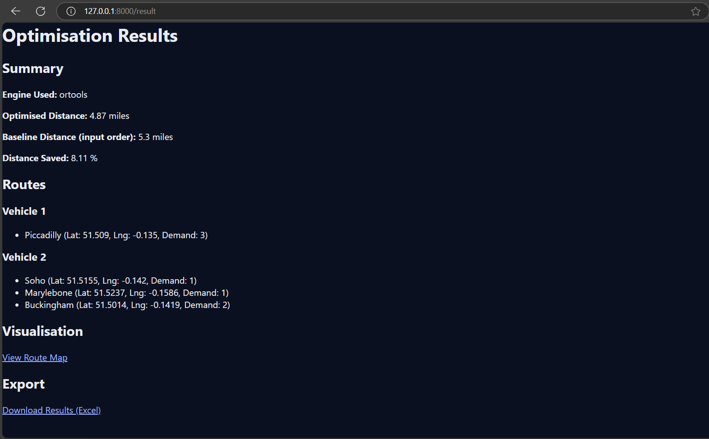
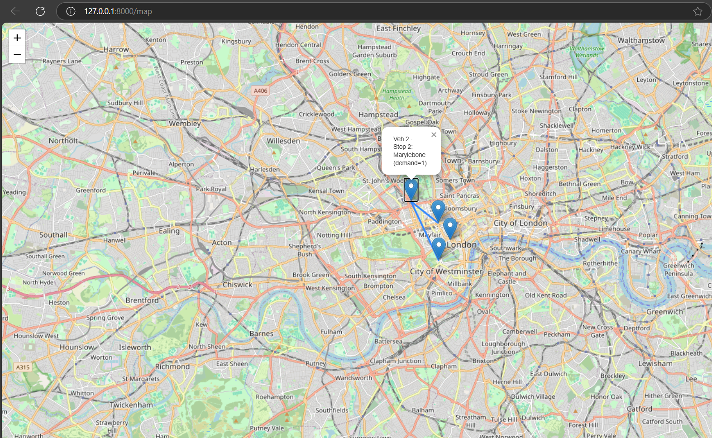

# 🚚 AI Logistics Optimisation MVP  
*Quantus AI – FastAPI + OR-Tools + Folium*  

## 🌐 Overview  
This project is the **Minimum Viable Product (MVP)** for Quantus AI, a company developing tailored **Artificial Intelligence solutions** for businesses and governments.  

The system focuses on **logistics route optimisation** — automatically generating efficient delivery routes given:  
- A depot location  
- Customer delivery stops (lat/lng, demand, time windows)  
- Vehicle capacity & availability  

By reducing mileage and travel time, businesses save fuel, money, and planning effort.  

---

## ✨ Features  
- 📂 Upload CSVs with delivery stops  
- 🚚 Multi-vehicle support  
- 📦 Vehicle capacity constraints  
- ⏱️ Time window constraints  
- 🗺️ Interactive map output with optimised routes (Folium)  
- 📊 Dashboard with optimised vs baseline distance + savings %  
- 📥 Export results as Excel (XLSX)  
- 🔑 API key protection for `/optimize` endpoints  
- ⚠️ Error handling & validation (e.g. missing lat/lng, max 500 stops)  
- 🌍 UK standards (miles + mph)  

---

## 🛠️ Tech Stack  
- **Backend**: FastAPI  
- **Optimisation**: Google OR-Tools (with greedy fallback)  
- **Mapping**: Folium  
- **Data**: Pandas  
- **Frontend**: Jinja2 Templates + HTML/CSS  

---

## 📸 Screenshots  

### Results Dashboard  
  

### Route Map  
  

 

---

## 🚀 Getting Started  

### 1. Clone the repo  
```bash
git clone https://github.com/Quantus-AI/ai-logistics-mvp.git
cd ai-logistics-mvp

```

### 2. Setup (Windows)
Run setup.bat

### 3. Run the app
Run run.bat

App runs at [localhost:8000](http://localhost:8000)

## 📂 Repo Structure
ai-logistics-mvp/
├── app/
│   ├── main.py           # FastAPI routes
│   ├── optimizer.py      # OR-Tools + greedy optimisation
├── data/                 # Sample CSVs
├── templates/            # HTML templates (dashboard, result, map)
├── static/               # CSS, JS
├── tests/                # Unit tests
├── setup.bat             # Windows setup script
├── run.bat               # Windows run script
└── requirements.txt      # Python dependencies

## 🧪 Example CSV Format
id,lat,lng,name,demand,tw_start,tw_end
1,51.5074,-0.1278,Stop A,2,08:00,18:00
2,51.5155,-0.1420,Stop B,1,09:00,17:00
...

## 📜 License
© 2025 Quantus AI Limited. All rights reserved.
This code is proprietary and may not be used without permission.

## 📫 Contact Details
👤 Founder: [Maaz (M-AI-Z)](https://github.com/M-AI-Z)

🌐 Organisation: [Quantus AI](https://github.com/Quantus-AI)